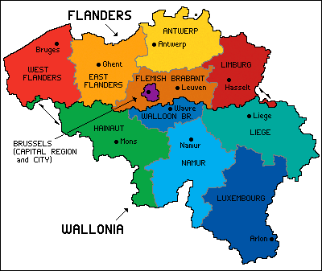

README
================
WeLoveDataScience
2017-07-28

geo\_facet
----------

> The geofacet R package provides a way to flexibly visualize data for different geographical regions by providing a ggplot2 faceting function `facet_geo()` which works just like ggplot2’s built-in faceting, except that the resulting arrangement of panels follows a grid that mimics the original geographic topology as closely as possible.

For more information on this exciting package, see <https://hafen.github.io/geofacet/>.

This repository is a quick demonstration on how to use `geo_facet` with a specific map created by WeLoveDataScience for Belgium (provinces + Brussels level).

We take as example data real estate prices evolution over more than 40 years in Belgium (open data provided by Belgium government).

Belgium map
-----------

### Our point of comparison

### data.frame

### Example of application

You can also embed plots, for example:

Note that the `echo = FALSE` parameter was added to the code chunk to prevent printing of the R code that generated the plot.
